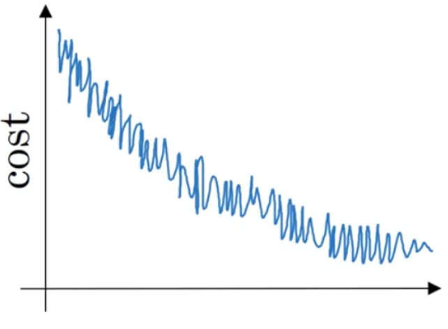
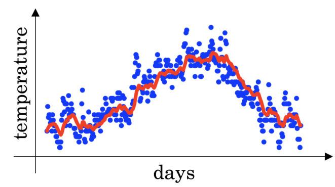
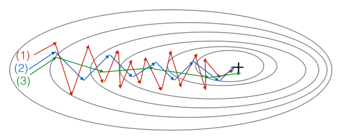

## Optimization algorithms

All the answers showed are correct.

**1. Which notation would you use to denote the 3ed layer's activations when the input is the 7th example from the 8th minibatch?**

$a^{[3]\\{8\\}(7)}$

**2. Which of these statements about mini-batch gradient descent do you agree with?**

One iteration of mini-batch gradient descent (computing on a single mini-batch) is faster than one iteration of batch gradient descent

**3. Why is the best mini-batch size usually not 1 and not m, but instead something in-between?**

If the mini-batch size is 1, you lose the benefits of vectorization across examples in the mini-batch

If the mini-batch size is m, you end up with batch gradient descent, which has to process the whole training set before making progress

**4. Suppose your learning algorithm's cost $J$, plotted as a function of the number of iterations, looks like this:**

**Which of the following do you agree with?**

If you're using mini-batch gradient descent, this looks acceptable. But if you're using batch gradient descent, something is wrong.

**5. Suppose the temperature in Casablanca over the first three days of January are the same:**

**Jan 1st: $\theta_1 = 10^oC$**

**Jan 2nd: $\theta_2 = 10^oC$**

**(We used Fahrenheit in lecture, so will use Celsius here in honor of the metric world.)**

**Say you use an exponentially weighted average with $\beta = 0.5$ to track the temperature: $v_0 = 0$, $v_t = \beta v_{t-1} + (1-\beta)\theta_t$. If $v_2$ is the value computed after day 2 without bias correction, and $v_2^{corrected}$ is the value you compute with bias correction. What are these values? (You might be able to do this without a calculator, bur you don't actually need one. Remember what is bias correction doing.)**

$v_2 = 7.5$, $v_2^{corrected} = 10$

**6. Which of these is NOT a good learning rate decay scheme? Here, t is the epoch number.**

$\alpha = e^t\alpha_0$

**7. You use an exponentially weighted average on the London temperature dataset. You use the following to track the temperature: $v_t = \beta v_{t-1} + (1-\beta)\theta_t$. The red line below was computed using $\beta = 0.9$. What would happen to your red curve as you vary $ \beta $? (Check the two that apply)**

Increasing $ \beta $ will shift the red line slightly to the right.

Decreasing $ \beta$ will create more oscillation within the red line.

**8. Consider this figure:**

**These plots were generated with gradient descent; with gradient descent with momentum ($ \beta = 0.5$) and gradient descent with momentum ($ \beta = 0.9$). Which curve corresponds to which algorithm?**

(1) is gradient descent. (2) is gradient descent with momentum (small $ \beta$). (3) is gradient descent with momentum (large $ \beta$)

**9. Suppose batch gradient descent in a deep network is taking excessively long to find a value of the parameters that achieves a small value for the cost function ${\cal J}(W^{[1]}, b^{[1]},...,W^{[L]}, b^{[L]})$. Which of the following techniques could help find parameter values that attain a small value for $\cal J$? (Check all that apply)**

Try tuning the learning rate $ \alpha$

Try using Adam

Try better random initialization for the weights

Try mini-batch gradient descent

**10. Which of the following statements about Adam is False?**

Adam should be used with batch gradient computations, not with mini-batches