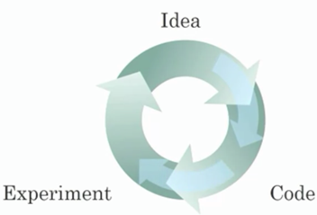

## Week 1 Quiz - Introduction to deep learning

All the answers showed are correct.

**1. What does the analogy "AI is the new electricity" refer to?**

Similar to electricity starting about 100 years ago, AI is transforming multiple industries.

**2. Which of these are reasons for Deep Learning recently taking off ? (Check the three options that apply.)**

Deep learning has resulted in significant important applications such as online advertising, speech recognition, and image recognition.

We have access to a lot more computational power.

We have access to a lot more data.

**3. Recall this diagram of iterating over different ML ideas. Which if the statements below are true? (Check all that apply.)**

Being able to try out ideas quickly allows deep learning engineers to iterate more quickly.

Faster computation can help speed up how long a team takes to iterate to a good idea.

Recent progress in deep learning algorithms has allowed us to train good models faster (even  without changing the CPU/GPU hardware).

**4. When an experienced deep learning engineer works on a new problem, they can usually use insight from previous problems to train a good model on the first try, without needing to iterate multiple times through different models. True/False?**

False.

**5. Which one of these plots represents a ReLU activation function?**

**6. Image for cat recognition is an example of "structured" data, because it is represented as a structured array in a computer. True/False?**

False

**7. A demographic dataset with statistics on different cities' population, GDP per capita, economic growth is an example of "unstructured" data because it contains data coming from different sources. True/False?** 

False

**8. Why is an RNA (Recurrent Neural Network) used for machine translation, say translating English to French? (Check all that apply.)**

It is applicable when the input/output is a sequence (e.g. a sequence of words).

**9. In this diagram which we hand-drew in lecture, what do the horizonal axis (x-axis) and vertical axis (y-axis) represent?**

x-axis is the amount of data

y-axis (vertical axis) is the performance of the algorithm.

**10. Assuming the trends described in the previous question's figure are accurate (and hoping you got the axis labels right), which of the following are true? (Check all that apply.)**

Increasing the training set size generally does not hurt an algorithm's performance, and it may help significantly.

Increasing the size of a neural network generally does not hurt an algorithm's performance, and it may help significantly.