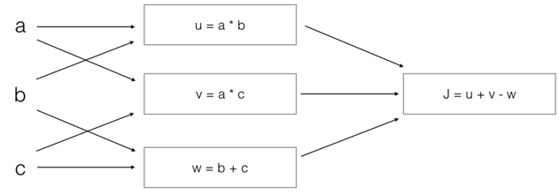

## Week 2 Quiz - Neural Networks Basics

All the answers showed are correct.

**1. What does a neuron compute?**

A neuron computes a linear function (z = Wx + b) followed by an activation function.

**2. Which of these is the "Logistic Loss"?**

$\mathcal{L}^{(i)} (\hat{y}^{(i)}, y^{(i)})= -(y^{(i)}log(\hat{y}^{(i)})+(1-y^{(i)})log(1-\hat{y}^{(i)}))$

**3. Suppose img is a (32, 32, 3) array, representing a 32x32 image with 3 color channels red, green and blue. How do you reshape this into a column vector?**

x = img.reshape((32\*32\*3, 1))

**4. Consider the two following random array "a" and "b":**

```python
a = np.random.randn(2, 3) #a.shape = (2, 3)
b = np.random.randn(2, 1) #b.shape = (2, 1)
c = a + b
```

**What will be the shape of "c"?**

c.shape = (2, 3)

**5. Consider the two following random array  "a" and "b":**

```python
a = np.random.randn(4, 3) #a.shape = (4, 3)
b = np.random.randn(3, 2) #b.shape = (3, 2)
c = a * b
```

**What will be the shape of "c"?**

The computation cannot happen because the sizes don't match. It's going to be "Error"!

**6. Suppose you have $n_x$ input features per example. Recall that  $X = [x^{(1)}x^{(2)}...x^{(m)}]$ . What is the dimension of X?**

$(n_x, m)$

**7. Recall that "np.dot(a, b)" performs a matrix multiplication on a and b, whereas "a * b" performs an element-wise multiplication.**

**Consider the two following random arrays "a" and "b":**

```python
a = np.random.randn(12288, 150) #a.shape = (12288, 150)
b = np.random.randn(150, 45)    #b.shape = (150, 45)
c = np.dot(a, b)
```

**What is the shape of c?**

c.shape = (12288, 45)

**8. Consider the following code snippet:**

```python
# a.shape = (3, 4)
# b.shape = (4, 1)

for i in range(3):
	for j in range(4):
		c[i][j] = a[i][j] + b[j]
```

**How do you vectorize this?**

c = a + b.T

**9. Consider the following code:**

```python
a = np.random.randn(3, 3)
b = np.random.randn(3, 1)
c = a * b
```

**What will be c (If you're not sure, feel free to run this in python to find out).**

This will invoke broadcasting, so b is copied three times to become (3, 3), and * is an element-wise product so c.shape will be (3, 3)

**10. Consider the following computation graph.**



**What is the output J?**

J = (a - 1) * (b + c)